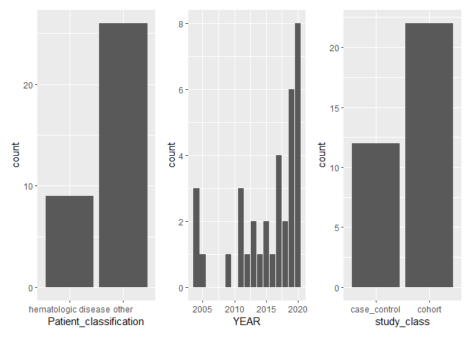

## Load R packages and data set


```r
library(dplyr)
library(meta)
library(metafor)
library(dmetar)
library(kableExtra)
library(ggplot2)
library(patchwork)
data_meta <- read.csv("data_YESadded.csv", header = TRUE)
```

## Tidy up the data frame

At the first stage of the project, we will perform an exploratory analysis and will only work with data from manuscripts, which reported age as the mean and standard deviation either directly or via email.

For this we will first select only data where `mean_report` was labeled as YES.
Then, we will check the structure of the data frame and delete columns which are not necessary, for instance, columns which report the median and range. 

From seeing the structure of the data frame, we can also notice that some data is not stored correctly. For example, `n_noIA` is saved as a character when it should be numeric. To overcome this, transform all data that will be used for computation into a numeric class.

Display the table.


```r
data_mean_r <- filter(data_meta, mean_report == "YES", .preserve = TRUE)
str(data_mean_r)
```

```
## 'data.frame':	23 obs. of  23 variables:
##  $ N          : int  2 6 8 10 11 12 13 14 15 17 ...
##  $ STUDY_ID   : int  11 55 65 88 96 99 106 108 117 143 ...
##  $ PMID       : int  33316401 32494955 32176795 31417154 31177621 31134053 30855077 30778699 30661296 30074643 ...
##  $ AUTHORS    : chr  "Dellière, S" "Waldeck, F" "Zou, P" "Lahmer, T" ...
##  $ YEAR       : int  2020 2020 2020 2019 2019 2019 2019 2019 2019 2018 ...
##  $ n_IA       : int  21 9 18 12 10 50 11 60 63 23 ...
##  $ n_noIA     : chr  "87" "72" "317" "72" ...
##  $ m_age_IA   : num  61 61 60.6 59 63 ...
##  $ m_age_noIA : num  60 65 55.8 60 68 ...
##  $ SD_IA      : num  11 9.69 12.69 8 14 ...
##  $ SD_noIA    : num  16 14.3 16.2 12 13.7 ...
##  $ md_IA      : num  NA NA NA NA NA NA NA NA NA NA ...
##  $ md_noIA    : num  NA NA NA NA NA NA NA NA NA NA ...
##  $ R1_IA      : num  NA NA NA NA NA NA NA NA NA NA ...
##  $ R2_IA      : num  NA NA NA NA NA NA NA NA NA NA ...
##  $ R1_noIA    : num  NA NA NA NA NA NA NA NA NA NA ...
##  $ R2_noIA    : num  NA NA NA NA NA NA NA NA NA NA ...
##  $ patient_g  : chr  "COVID19" "influenza" "pneumonia" "cirrhosis" ...
##  $ ICU        : chr  "YES" "YES" "NO" "YES" ...
##  $ prophylaxis: chr  "NO" "NO" "NO" "NO" ...
##  $ IA_class   : chr  "probable" NA "probable" "probable" ...
##  $ study_class: chr  "cohort" "cohort" "cohort" "cohort" ...
##  $ mean_report: chr  "YES" "YES" "YES" "YES" ...
```

```r
data_mean_rS <- select(data_mean_r,-c(N,md_IA,md_noIA,R1_IA,R2_IA,R1_noIA,R2_noIA, mean_report))
data_mean_rS$n_IA <- as.numeric(data_mean_rS$n_IA)
data_mean_rS$n_noIA <- as.numeric(data_mean_rS$n_noIA)
data_mean_rS$ICU <- ifelse(data_mean_rS$ICU=="YES",1,0)
data_mean_rS$prophylaxis <- ifelse(data_mean_rS$prophylaxis=="YES",1,0)

data_mean_rS %>%
  kbl() %>%
  kable_styling(bootstrap_options = c("striped", "hover", "condensed"), font_size = 11) %>%
  column_spec(6, color = "white",
              background = spec_color(data_mean_rS$n_noIA, end = 0.7),
              popover = paste("am:", data_mean_rS$n_noIA)) 
```

<table class="table table-striped table-hover table-condensed" style="font-size: 11px; margin-left: auto; margin-right: auto;">
 <thead>
  <tr>
   <th style="text-align:right;"> STUDY_ID </th>
   <th style="text-align:right;"> PMID </th>
   <th style="text-align:left;"> AUTHORS </th>
   <th style="text-align:right;"> YEAR </th>
   <th style="text-align:right;"> n_IA </th>
   <th style="text-align:right;"> n_noIA </th>
   <th style="text-align:right;"> m_age_IA </th>
   <th style="text-align:right;"> m_age_noIA </th>
   <th style="text-align:right;"> SD_IA </th>
   <th style="text-align:right;"> SD_noIA </th>
   <th style="text-align:left;"> patient_g </th>
   <th style="text-align:right;"> ICU </th>
   <th style="text-align:right;"> prophylaxis </th>
   <th style="text-align:left;"> IA_class </th>
   <th style="text-align:left;"> study_class </th>
  </tr>
 </thead>
<tbody>
  <tr>
   <td style="text-align:right;"> 11 </td>
   <td style="text-align:right;"> 33316401 </td>
   <td style="text-align:left;"> Dellière, S </td>
   <td style="text-align:right;"> 2020 </td>
   <td style="text-align:right;"> 21 </td>
   <td style="text-align:right;color: white !important;background-color: rgba(71, 17, 100, 1) !important;" data-toggle="popover" data-container="body" data-trigger="hover" data-placement="right" data-content="am: 87"> 87 </td>
   <td style="text-align:right;"> 61.00 </td>
   <td style="text-align:right;"> 60.00 </td>
   <td style="text-align:right;"> 11.00 </td>
   <td style="text-align:right;"> 16.00 </td>
   <td style="text-align:left;"> COVID19 </td>
   <td style="text-align:right;"> 1 </td>
   <td style="text-align:right;"> 0 </td>
   <td style="text-align:left;"> probable </td>
   <td style="text-align:left;"> cohort </td>
  </tr>
  <tr>
   <td style="text-align:right;"> 55 </td>
   <td style="text-align:right;"> 32494955 </td>
   <td style="text-align:left;"> Waldeck, F </td>
   <td style="text-align:right;"> 2020 </td>
   <td style="text-align:right;"> 9 </td>
   <td style="text-align:right;color: white !important;background-color: rgba(71, 13, 96, 1) !important;" data-toggle="popover" data-container="body" data-trigger="hover" data-placement="right" data-content="am: 72"> 72 </td>
   <td style="text-align:right;"> 61.00 </td>
   <td style="text-align:right;"> 65.00 </td>
   <td style="text-align:right;"> 9.69 </td>
   <td style="text-align:right;"> 14.31 </td>
   <td style="text-align:left;"> influenza </td>
   <td style="text-align:right;"> 1 </td>
   <td style="text-align:right;"> 0 </td>
   <td style="text-align:left;"> NA </td>
   <td style="text-align:left;"> cohort </td>
  </tr>
  <tr>
   <td style="text-align:right;"> 65 </td>
   <td style="text-align:right;"> 32176795 </td>
   <td style="text-align:left;"> Zou, P </td>
   <td style="text-align:right;"> 2020 </td>
   <td style="text-align:right;"> 18 </td>
   <td style="text-align:right;color: white !important;background-color: rgba(64, 69, 136, 1) !important;" data-toggle="popover" data-container="body" data-trigger="hover" data-placement="right" data-content="am: 317"> 317 </td>
   <td style="text-align:right;"> 60.56 </td>
   <td style="text-align:right;"> 55.82 </td>
   <td style="text-align:right;"> 12.69 </td>
   <td style="text-align:right;"> 16.23 </td>
   <td style="text-align:left;"> pneumonia </td>
   <td style="text-align:right;"> 0 </td>
   <td style="text-align:right;"> 0 </td>
   <td style="text-align:left;"> probable </td>
   <td style="text-align:left;"> cohort </td>
  </tr>
  <tr>
   <td style="text-align:right;"> 88 </td>
   <td style="text-align:right;"> 31417154 </td>
   <td style="text-align:left;"> Lahmer, T </td>
   <td style="text-align:right;"> 2019 </td>
   <td style="text-align:right;"> 12 </td>
   <td style="text-align:right;color: white !important;background-color: rgba(71, 13, 96, 1) !important;" data-toggle="popover" data-container="body" data-trigger="hover" data-placement="right" data-content="am: 72"> 72 </td>
   <td style="text-align:right;"> 59.00 </td>
   <td style="text-align:right;"> 60.00 </td>
   <td style="text-align:right;"> 8.00 </td>
   <td style="text-align:right;"> 12.00 </td>
   <td style="text-align:left;"> cirrhosis </td>
   <td style="text-align:right;"> 1 </td>
   <td style="text-align:right;"> 0 </td>
   <td style="text-align:left;"> probable </td>
   <td style="text-align:left;"> cohort </td>
  </tr>
  <tr>
   <td style="text-align:right;"> 96 </td>
   <td style="text-align:right;"> 31177621 </td>
   <td style="text-align:left;"> Tejerina, EE </td>
   <td style="text-align:right;"> 2019 </td>
   <td style="text-align:right;"> 10 </td>
   <td style="text-align:right;color: white !important;background-color: rgba(33, 166, 133, 1) !important;" data-toggle="popover" data-container="body" data-trigger="hover" data-placement="right" data-content="am: 868"> 868 </td>
   <td style="text-align:right;"> 63.00 </td>
   <td style="text-align:right;"> 68.00 </td>
   <td style="text-align:right;"> 14.00 </td>
   <td style="text-align:right;"> 13.70 </td>
   <td style="text-align:left;"> critically_ill </td>
   <td style="text-align:right;"> 1 </td>
   <td style="text-align:right;"> 0 </td>
   <td style="text-align:left;"> proven </td>
   <td style="text-align:left;"> cohort </td>
  </tr>
  <tr>
   <td style="text-align:right;"> 99 </td>
   <td style="text-align:right;"> 31134053 </td>
   <td style="text-align:left;"> Napolioni, V </td>
   <td style="text-align:right;"> 2019 </td>
   <td style="text-align:right;"> 50 </td>
   <td style="text-align:right;color: white !important;background-color: rgba(65, 66, 135, 1) !important;" data-toggle="popover" data-container="body" data-trigger="hover" data-placement="right" data-content="am: 302"> 302 </td>
   <td style="text-align:right;"> 37.30 </td>
   <td style="text-align:right;"> 40.30 </td>
   <td style="text-align:right;"> 13.10 </td>
   <td style="text-align:right;"> 15.00 </td>
   <td style="text-align:left;"> allogeneic_HSCT </td>
   <td style="text-align:right;"> 0 </td>
   <td style="text-align:right;"> 0 </td>
   <td style="text-align:left;"> NA </td>
   <td style="text-align:left;"> cohort </td>
  </tr>
  <tr>
   <td style="text-align:right;"> 106 </td>
   <td style="text-align:right;"> 30855077 </td>
   <td style="text-align:left;"> Bitterman, R </td>
   <td style="text-align:right;"> 2019 </td>
   <td style="text-align:right;"> 11 </td>
   <td style="text-align:right;color: white !important;background-color: rgba(72, 20, 102, 1) !important;" data-toggle="popover" data-container="body" data-trigger="hover" data-placement="right" data-content="am: 96"> 96 </td>
   <td style="text-align:right;"> 65.00 </td>
   <td style="text-align:right;"> 56.00 </td>
   <td style="text-align:right;"> 8.00 </td>
   <td style="text-align:right;"> 16.00 </td>
   <td style="text-align:left;"> hematology_oncology </td>
   <td style="text-align:right;"> 0 </td>
   <td style="text-align:right;"> 1 </td>
   <td style="text-align:left;"> proven </td>
   <td style="text-align:left;"> cohort </td>
  </tr>
  <tr>
   <td style="text-align:right;"> 108 </td>
   <td style="text-align:right;"> 30778699 </td>
   <td style="text-align:left;"> Levesque, E </td>
   <td style="text-align:right;"> 2019 </td>
   <td style="text-align:right;"> 60 </td>
   <td style="text-align:right;color: white !important;background-color: rgba(72, 32, 113, 1) !important;" data-toggle="popover" data-container="body" data-trigger="hover" data-placement="right" data-content="am: 148"> 148 </td>
   <td style="text-align:right;"> 55.40 </td>
   <td style="text-align:right;"> 54.70 </td>
   <td style="text-align:right;"> 12.60 </td>
   <td style="text-align:right;"> 11.50 </td>
   <td style="text-align:left;"> cirrhosis </td>
   <td style="text-align:right;"> 1 </td>
   <td style="text-align:right;"> 0 </td>
   <td style="text-align:left;"> MIX </td>
   <td style="text-align:left;"> case_control </td>
  </tr>
  <tr>
   <td style="text-align:right;"> 117 </td>
   <td style="text-align:right;"> 30661296 </td>
   <td style="text-align:left;"> Huang, L </td>
   <td style="text-align:right;"> 2019 </td>
   <td style="text-align:right;"> 63 </td>
   <td style="text-align:right;color: white !important;background-color: rgba(69, 6, 90, 1) !important;" data-toggle="popover" data-container="body" data-trigger="hover" data-placement="right" data-content="am: 46"> 46 </td>
   <td style="text-align:right;"> 63.00 </td>
   <td style="text-align:right;"> 57.00 </td>
   <td style="text-align:right;"> 13.00 </td>
   <td style="text-align:right;"> 18.00 </td>
   <td style="text-align:left;"> influenza </td>
   <td style="text-align:right;"> 1 </td>
   <td style="text-align:right;"> 0 </td>
   <td style="text-align:left;"> MIX </td>
   <td style="text-align:left;"> cohort </td>
  </tr>
  <tr>
   <td style="text-align:right;"> 143 </td>
   <td style="text-align:right;"> 30074643 </td>
   <td style="text-align:left;"> Cook, JC </td>
   <td style="text-align:right;"> 2018 </td>
   <td style="text-align:right;"> 23 </td>
   <td style="text-align:right;color: white !important;background-color: rgba(69, 6, 90, 1) !important;" data-toggle="popover" data-container="body" data-trigger="hover" data-placement="right" data-content="am: 46"> 46 </td>
   <td style="text-align:right;"> 54.00 </td>
   <td style="text-align:right;"> 46.00 </td>
   <td style="text-align:right;"> 9.00 </td>
   <td style="text-align:right;"> 14.00 </td>
   <td style="text-align:left;"> cardiac_transplantation </td>
   <td style="text-align:right;"> 0 </td>
   <td style="text-align:right;"> 0 </td>
   <td style="text-align:left;"> MIX </td>
   <td style="text-align:left;"> case_control </td>
  </tr>
  <tr>
   <td style="text-align:right;"> 167 </td>
   <td style="text-align:right;"> 29239468 </td>
   <td style="text-align:left;"> Kaya, S </td>
   <td style="text-align:right;"> 2017 </td>
   <td style="text-align:right;"> 65 </td>
   <td style="text-align:right;color: white !important;background-color: rgba(71, 17, 100, 1) !important;" data-toggle="popover" data-container="body" data-trigger="hover" data-placement="right" data-content="am: 87"> 87 </td>
   <td style="text-align:right;"> 44.80 </td>
   <td style="text-align:right;"> 60.20 </td>
   <td style="text-align:right;"> 16.40 </td>
   <td style="text-align:right;"> 17.10 </td>
   <td style="text-align:left;"> febrile_neutropenic </td>
   <td style="text-align:right;"> 0 </td>
   <td style="text-align:right;"> 1 </td>
   <td style="text-align:left;"> MIX </td>
   <td style="text-align:left;"> case_control </td>
  </tr>
  <tr>
   <td style="text-align:right;"> 168 </td>
   <td style="text-align:right;"> 29239266 </td>
   <td style="text-align:left;"> Zhang, X </td>
   <td style="text-align:right;"> 2017 </td>
   <td style="text-align:right;"> 53 </td>
   <td style="text-align:right;color: white !important;background-color: rgba(67, 191, 113, 1) !important;" data-toggle="popover" data-container="body" data-trigger="hover" data-placement="right" data-content="am: 1024"> 1024 </td>
   <td style="text-align:right;"> 48.64 </td>
   <td style="text-align:right;"> 49.25 </td>
   <td style="text-align:right;"> 12.07 </td>
   <td style="text-align:right;"> 13.52 </td>
   <td style="text-align:left;"> liver_failure </td>
   <td style="text-align:right;"> 0 </td>
   <td style="text-align:right;"> 0 </td>
   <td style="text-align:left;"> NA </td>
   <td style="text-align:left;"> cohort </td>
  </tr>
  <tr>
   <td style="text-align:right;"> 173 </td>
   <td style="text-align:right;"> 29118175 </td>
   <td style="text-align:left;"> White, PL </td>
   <td style="text-align:right;"> 2017 </td>
   <td style="text-align:right;"> 6 </td>
   <td style="text-align:right;color: white !important;background-color: rgba(68, 58, 131, 1) !important;" data-toggle="popover" data-container="body" data-trigger="hover" data-placement="right" data-content="am: 268"> 268 </td>
   <td style="text-align:right;"> 53.30 </td>
   <td style="text-align:right;"> 58.20 </td>
   <td style="text-align:right;"> 8.70 </td>
   <td style="text-align:right;"> 14.30 </td>
   <td style="text-align:left;"> hematology_oncology </td>
   <td style="text-align:right;"> 0 </td>
   <td style="text-align:right;"> 0 </td>
   <td style="text-align:left;"> proven </td>
   <td style="text-align:left;"> cohort </td>
  </tr>
  <tr>
   <td style="text-align:right;"> 192 </td>
   <td style="text-align:right;"> 28652112 </td>
   <td style="text-align:left;"> López-Medrano, F </td>
   <td style="text-align:right;"> 2017 </td>
   <td style="text-align:right;"> 61 </td>
   <td style="text-align:right;color: white !important;background-color: rgba(70, 10, 93, 1) !important;" data-toggle="popover" data-container="body" data-trigger="hover" data-placement="right" data-content="am: 61"> 61 </td>
   <td style="text-align:right;"> 54.60 </td>
   <td style="text-align:right;"> 48.60 </td>
   <td style="text-align:right;"> 14.20 </td>
   <td style="text-align:right;"> 15.50 </td>
   <td style="text-align:left;"> kidney_transplantation </td>
   <td style="text-align:right;"> 0 </td>
   <td style="text-align:right;"> 0 </td>
   <td style="text-align:left;"> MIX </td>
   <td style="text-align:left;"> case_control </td>
  </tr>
  <tr>
   <td style="text-align:right;"> 249 </td>
   <td style="text-align:right;"> 26813515 </td>
   <td style="text-align:left;"> López-Medrano, F </td>
   <td style="text-align:right;"> 2016 </td>
   <td style="text-align:right;"> 51 </td>
   <td style="text-align:right;color: white !important;background-color: rgba(70, 8, 92, 1) !important;" data-toggle="popover" data-container="body" data-trigger="hover" data-placement="right" data-content="am: 51"> 51 </td>
   <td style="text-align:right;"> 57.30 </td>
   <td style="text-align:right;"> 54.40 </td>
   <td style="text-align:right;"> 15.60 </td>
   <td style="text-align:right;"> 14.50 </td>
   <td style="text-align:left;"> kidney_transplantation </td>
   <td style="text-align:right;"> 0 </td>
   <td style="text-align:right;"> 0 </td>
   <td style="text-align:left;"> MIX </td>
   <td style="text-align:left;"> case_control </td>
  </tr>
  <tr>
   <td style="text-align:right;"> 253 </td>
   <td style="text-align:right;"> 26683245 </td>
   <td style="text-align:left;"> Nagao, M </td>
   <td style="text-align:right;"> 2015 </td>
   <td style="text-align:right;"> 5 </td>
   <td style="text-align:right;color: white !important;background-color: rgba(68, 1, 84, 1) !important;" data-toggle="popover" data-container="body" data-trigger="hover" data-placement="right" data-content="am: 25"> 25 </td>
   <td style="text-align:right;"> 51.80 </td>
   <td style="text-align:right;"> 53.50 </td>
   <td style="text-align:right;"> 8.80 </td>
   <td style="text-align:right;"> 10.80 </td>
   <td style="text-align:left;"> liver_failure </td>
   <td style="text-align:right;"> 0 </td>
   <td style="text-align:right;"> 1 </td>
   <td style="text-align:left;"> MIX </td>
   <td style="text-align:left;"> case_control </td>
  </tr>
  <tr>
   <td style="text-align:right;"> 301 </td>
   <td style="text-align:right;"> 25681376 </td>
   <td style="text-align:left;"> Heylen, L </td>
   <td style="text-align:right;"> 2015 </td>
   <td style="text-align:right;"> 41 </td>
   <td style="text-align:right;color: white !important;background-color: rgba(71, 16, 100, 1) !important;" data-toggle="popover" data-container="body" data-trigger="hover" data-placement="right" data-content="am: 82"> 82 </td>
   <td style="text-align:right;"> 58.00 </td>
   <td style="text-align:right;"> 55.00 </td>
   <td style="text-align:right;"> 12.00 </td>
   <td style="text-align:right;"> 12.00 </td>
   <td style="text-align:left;"> kidney_transplantation </td>
   <td style="text-align:right;"> 0 </td>
   <td style="text-align:right;"> 0 </td>
   <td style="text-align:left;"> MIX </td>
   <td style="text-align:left;"> case_control </td>
  </tr>
  <tr>
   <td style="text-align:right;"> 331 </td>
   <td style="text-align:right;"> 24930648 </td>
   <td style="text-align:left;"> Kurosaki, F </td>
   <td style="text-align:right;"> 2014 </td>
   <td style="text-align:right;"> 15 </td>
   <td style="text-align:right;color: white !important;background-color: rgba(47, 108, 142, 1) !important;" data-toggle="popover" data-container="body" data-trigger="hover" data-placement="right" data-content="am: 524"> 524 </td>
   <td style="text-align:right;"> 69.20 </td>
   <td style="text-align:right;"> 64.20 </td>
   <td style="text-align:right;"> 7.00 </td>
   <td style="text-align:right;"> 10.60 </td>
   <td style="text-align:left;"> interstitial_pneumonia </td>
   <td style="text-align:right;"> 0 </td>
   <td style="text-align:right;"> 0 </td>
   <td style="text-align:left;"> proven </td>
   <td style="text-align:left;"> cohort </td>
  </tr>
  <tr>
   <td style="text-align:right;"> 366 </td>
   <td style="text-align:right;"> 24151434 </td>
   <td style="text-align:left;"> Chen, J </td>
   <td style="text-align:right;"> 2013 </td>
   <td style="text-align:right;"> 39 </td>
   <td style="text-align:right;color: white !important;background-color: rgba(70, 7, 90, 1) !important;" data-toggle="popover" data-container="body" data-trigger="hover" data-placement="right" data-content="am: 48"> 48 </td>
   <td style="text-align:right;"> 43.00 </td>
   <td style="text-align:right;"> 37.50 </td>
   <td style="text-align:right;"> 11.65 </td>
   <td style="text-align:right;"> 9.16 </td>
   <td style="text-align:left;"> liver_failure </td>
   <td style="text-align:right;"> 1 </td>
   <td style="text-align:right;"> 0 </td>
   <td style="text-align:left;"> MIX </td>
   <td style="text-align:left;"> case_control </td>
  </tr>
  <tr>
   <td style="text-align:right;"> 413 </td>
   <td style="text-align:right;"> 22895826 </td>
   <td style="text-align:left;"> Wauters, J </td>
   <td style="text-align:right;"> 2012 </td>
   <td style="text-align:right;"> 9 </td>
   <td style="text-align:right;color: white !important;background-color: rgba(68, 3, 86, 1) !important;" data-toggle="popover" data-container="body" data-trigger="hover" data-placement="right" data-content="am: 31"> 31 </td>
   <td style="text-align:right;"> 53.00 </td>
   <td style="text-align:right;"> 48.00 </td>
   <td style="text-align:right;"> 10.00 </td>
   <td style="text-align:right;"> 14.00 </td>
   <td style="text-align:left;"> influenza </td>
   <td style="text-align:right;"> 1 </td>
   <td style="text-align:right;"> 0 </td>
   <td style="text-align:left;"> MIX </td>
   <td style="text-align:left;"> cohort </td>
  </tr>
  <tr>
   <td style="text-align:right;"> 441 </td>
   <td style="text-align:right;"> 22023558 </td>
   <td style="text-align:left;"> Xu, H </td>
   <td style="text-align:right;"> 2011 </td>
   <td style="text-align:right;"> 30 </td>
   <td style="text-align:right;color: white !important;background-color: rgba(70, 10, 93, 1) !important;" data-toggle="popover" data-container="body" data-trigger="hover" data-placement="right" data-content="am: 60"> 60 </td>
   <td style="text-align:right;"> 77.20 </td>
   <td style="text-align:right;"> 76.40 </td>
   <td style="text-align:right;"> 7.20 </td>
   <td style="text-align:right;"> 8.30 </td>
   <td style="text-align:left;"> COPD </td>
   <td style="text-align:right;"> 0 </td>
   <td style="text-align:right;"> 0 </td>
   <td style="text-align:left;"> probable </td>
   <td style="text-align:left;"> case_control </td>
  </tr>
  <tr>
   <td style="text-align:right;"> 681 </td>
   <td style="text-align:right;"> 15987390 </td>
   <td style="text-align:left;"> Garnacho-Montero, J </td>
   <td style="text-align:right;"> 2005 </td>
   <td style="text-align:right;"> 36 </td>
   <td style="text-align:right;color: white !important;background-color: rgba(34, 141, 141, 1) !important;" data-toggle="popover" data-container="body" data-trigger="hover" data-placement="right" data-content="am: 720"> 720 </td>
   <td style="text-align:right;"> 58.70 </td>
   <td style="text-align:right;"> 56.40 </td>
   <td style="text-align:right;"> 16.60 </td>
   <td style="text-align:right;"> 17.40 </td>
   <td style="text-align:left;"> critically_ill </td>
   <td style="text-align:right;"> 1 </td>
   <td style="text-align:right;"> 0 </td>
   <td style="text-align:left;"> MIX </td>
   <td style="text-align:left;"> NA </td>
  </tr>
  <tr>
   <td style="text-align:right;"> 710 </td>
   <td style="text-align:right;"> 15023157 </td>
   <td style="text-align:left;"> Muñoz, P </td>
   <td style="text-align:right;"> 2004 </td>
   <td style="text-align:right;"> 24 </td>
   <td style="text-align:right;color: white !important;background-color: rgba(69, 56, 129, 1) !important;" data-toggle="popover" data-container="body" data-trigger="hover" data-placement="right" data-content="am: 254"> 254 </td>
   <td style="text-align:right;"> 55.00 </td>
   <td style="text-align:right;"> 53.00 </td>
   <td style="text-align:right;"> 8.60 </td>
   <td style="text-align:right;"> 9.70 </td>
   <td style="text-align:left;"> heart_transplanaion </td>
   <td style="text-align:right;"> 0 </td>
   <td style="text-align:right;"> 1 </td>
   <td style="text-align:left;"> MIX </td>
   <td style="text-align:left;"> cohort </td>
  </tr>
</tbody>
</table>

## Have a quick look at the data
Now let's have a look at the patient groups, which represent their primary disease reported in each study. By looking at the histogram we can see how many observations we have for each group.


```r
p1 <- ggplot(data_mean_rS) + geom_bar(aes(x = patient_g)) + coord_flip()
p2 <- ggplot(data_mean_rS) + geom_bar(aes(x = YEAR)) 
data_mean_rS_noNA <- na.omit(subset(data_mean_rS, select = c(study_class)))
p3 <- ggplot(data_mean_rS_noNA) + geom_bar(aes(x = study_class)) 
```


```r
p1 | p2 | p3
```


## Calculate effect sizes as the raw mean differences
We can calculate effect size, presented in this instance as a raw mean difference. We will then pool effect sizes by using the `metafor` package.

```r
dat1 <- escalc(measure="MD", m1i=m_age_IA, sd1i=SD_IA, n1i=n_IA,
                              m2i=m_age_noIA, sd2i=SD_noIA, n2i=n_noIA, data=data_mean_rS)
res1 <- rma(yi, vi, data=dat1)
res1
```

```
## 
## Random-Effects Model (k = 23; tau^2 estimator: REML)
## 
## tau^2 (estimated amount of total heterogeneity): 19.5991 (SE = 8.1896)
## tau (square root of estimated tau^2 value):      4.4271
## I^2 (total heterogeneity / total variability):   75.59%
## H^2 (total variability / sampling variability):  4.10
## 
## Test for Heterogeneity:
## Q(df = 22) = 79.6888, p-val < .0001
## 
## Model Results:
## 
## estimate      se    zval    pval    ci.lb   ci.ub 
##   1.2775  1.0926  1.1692  0.2423  -0.8639  3.4188    
## 
## ---
## Signif. codes:  0 '***' 0.001 '**' 0.01 '*' 0.05 '.' 0.1 ' ' 1
```

```r
forest(res1)
```

<!-- -->

## Calculate effect sizes as the standardized mean differences
Next, the `meta` package will be used to calculate the standardized mean difference.


```r
m.cont <- metacont(n.e = n_IA,
                   mean.e = m_age_IA,
                   sd.e = SD_IA,
                   n.c = n_noIA,
                   mean.c = m_age_noIA,
                   sd.c = SD_noIA,
                   studlab = AUTHORS,
                   data = data_mean_rS,
                   sm = "SMD",
                   method.smd = "Hedges",
                   comb.fixed = FALSE,
                   comb.random = TRUE,
                   method.tau = "REML",
                   hakn = TRUE,
                   title = "Age as a risk factor for IA",
                   prediction = TRUE)
m.cont
```

```
## Review:     Age as a risk factor for IA
## 
##                         SMD             95%-CI %W(random)
## Dellière, S          0.0654 [-0.4112;  0.5420]        4.3
## Waldeck, F          -0.2848 [-0.9792;  0.4096]        3.0
## Zou, P               0.2943 [-0.1811;  0.7698]        4.3
## Lahmer, T           -0.0858 [-0.6971;  0.5254]        3.4
## Tejerina, EE        -0.3646 [-0.9882;  0.2590]        3.4
## Napolioni, V        -0.2030 [-0.5026;  0.0967]        5.8
## Bitterman, R         0.5796 [-0.0493;  1.2084]        3.3
## Levesque, E          0.0590 [-0.2410;  0.3590]        5.7
## Huang, L             0.3893 [ 0.0056;  0.7731]        5.1
## Cook, JC             0.6288 [ 0.1168;  1.1409]        4.1
## Kaya, S             -0.9118 [-1.2495; -0.5741]        5.4
## Zhang, X            -0.0453 [-0.3214;  0.2308]        5.9
## White, PL           -0.3437 [-1.1533;  0.4659]        2.5
## López-Medrano, F     0.4011 [ 0.0426;  0.7597]        5.3
## López-Medrano, F     0.1911 [-0.1979;  0.5802]        5.0
## Nagao, M            -0.1570 [-1.1181;  0.8042]        1.9
## Heylen, L            0.2484 [-0.1278;  0.6247]        5.1
## Kurosaki, F          0.4745 [-0.0395;  0.9886]        4.1
## Chen, J              0.5268 [ 0.0968;  0.9569]        4.7
## Wauters, J           0.3696 [-0.3774;  1.1166]        2.7
## Xu, H                0.0997 [-0.3388;  0.5382]        4.6
## Garnacho-Montero, J  0.1323 [-0.2025;  0.4671]        5.5
## Muñoz, P             0.2075 [-0.2114;  0.6264]        4.8
## 
## Number of studies combined: k = 23
## 
##                         SMD            95%-CI    t p-value
## Random effects model 0.1039 [-0.0552; 0.2630] 1.35  0.1893
## Prediction interval         [-0.5286; 0.7364]             
## 
## Quantifying heterogeneity:
##  tau^2 = 0.0866 [0.0282; 0.2069]; tau = 0.2943 [0.1680; 0.4548]
##  I^2 = 65.4% [46.3%; 77.8%]; H = 1.70 [1.36; 2.12]
## 
## Test of heterogeneity:
##      Q d.f.  p-value
##  63.67   22 < 0.0001
## 
## Details on meta-analytical method:
## - Inverse variance method
## - Restricted maximum-likelihood estimator for tau^2
## - Q-profile method for confidence interval of tau^2 and tau
## - Hartung-Knapp adjustment for random effects model
## - Hedges' g (bias corrected standardised mean difference)
```

## Check for potential outliers
Let's check if our data contains any outliers or influential cases that may affect robustness of the result.

```r
m.count.no <- find.outliers(m.cont)  
m.count.no
```

```
## Identified outliers (random-effects model) 
## ------------------------------------------ 
## "Kaya, S" 
##  
## Results with outliers removed 
## ----------------------------- 
## Review:     Age as a risk factor for IA
## 
##                         SMD             95%-CI %W(random) exclude
## Dellière, S          0.0654 [-0.4112;  0.5420]        4.2        
## Waldeck, F          -0.2848 [-0.9792;  0.4096]        2.2        
## Zou, P               0.2943 [-0.1811;  0.7698]        4.2        
## Lahmer, T           -0.0858 [-0.6971;  0.5254]        2.8        
## Tejerina, EE        -0.3646 [-0.9882;  0.2590]        2.7        
## Napolioni, V        -0.2030 [-0.5026;  0.0967]        7.8        
## Bitterman, R         0.5796 [-0.0493;  1.2084]        2.6        
## Levesque, E          0.0590 [-0.2410;  0.3590]        7.8        
## Huang, L             0.3893 [ 0.0056;  0.7731]        5.7        
## Cook, JC             0.6288 [ 0.1168;  1.1409]        3.7        
## Kaya, S             -0.9118 [-1.2495; -0.5741]        0.0       *
## Zhang, X            -0.0453 [-0.3214;  0.2308]        8.6        
## White, PL           -0.3437 [-1.1533;  0.4659]        1.7        
## López-Medrano, F     0.4011 [ 0.0426;  0.7597]        6.3        
## López-Medrano, F     0.1911 [-0.1979;  0.5802]        5.6        
## Nagao, M            -0.1570 [-1.1181;  0.8042]        1.2        
## Heylen, L            0.2484 [-0.1278;  0.6247]        5.9        
## Kurosaki, F          0.4745 [-0.0395;  0.9886]        3.7        
## Chen, J              0.5268 [ 0.0968;  0.9569]        4.9        
## Wauters, J           0.3696 [-0.3774;  1.1166]        2.0        
## Xu, H                0.0997 [-0.3388;  0.5382]        4.7        
## Garnacho-Montero, J  0.1323 [-0.2025;  0.4671]        6.8        
## Muñoz, P             0.2075 [-0.2114;  0.6264]        5.0        
## 
## Number of studies combined: k = 22
## 
##                         SMD            95%-CI    t p-value
## Random effects model 0.1594 [ 0.0427; 0.2761] 2.84  0.0098
## Prediction interval         [-0.1374; 0.4562]             
## 
## Quantifying heterogeneity:
##  tau^2 = 0.0171 [0.0000; 0.0991]; tau = 0.1307 [0.0000; 0.3148]
##  I^2 = 26.0% [0.0%; 56.1%]; H = 1.16 [1.00; 1.51]
## 
## Test of heterogeneity:
##      Q d.f. p-value
##  28.38   21  0.1298
## 
## Details on meta-analytical method:
## - Inverse variance method
## - Restricted maximum-likelihood estimator for tau^2
## - Q-profile method for confidence interval of tau^2 and tau
## - Hartung-Knapp adjustment for random effects model
## - Hedges' g (bias corrected standardised mean difference)
```

```r
m.cont.inf <- InfluenceAnalysis(m.cont, random = TRUE)
```

```
## [===========================================================================] DONE
```

```r
plot(m.cont.inf, "influence")
```

<!-- -->

It seems that the data contains the outlier that has a substantial effect on heterogeneity. 

Let's further check if the removal of any data point from our data frame significantly impacts the overall heterogeneity. 


```r
plot(m.cont.inf, "es")
```

<!-- -->

```r
plot(m.cont.inf, "i2")
```

<!-- -->

