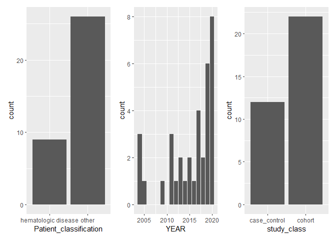
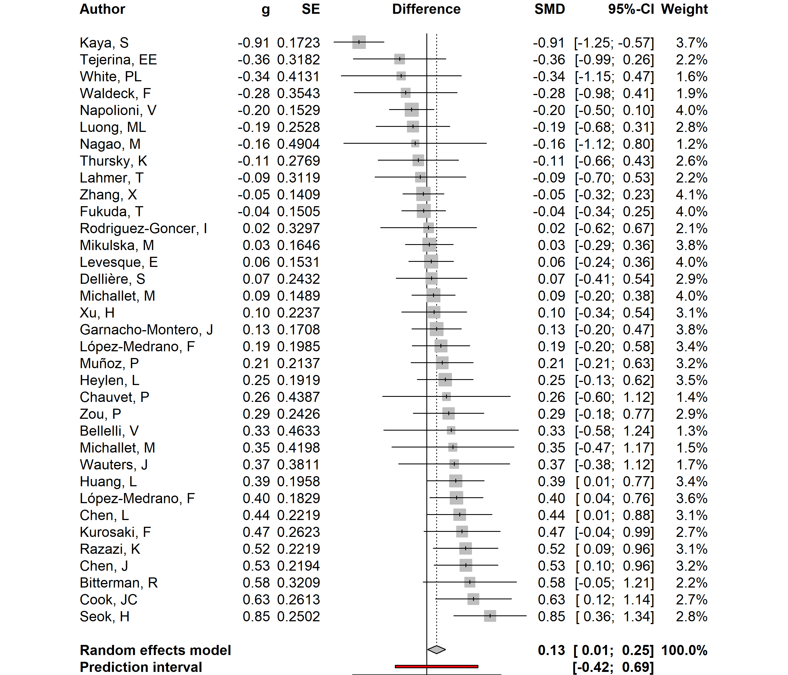
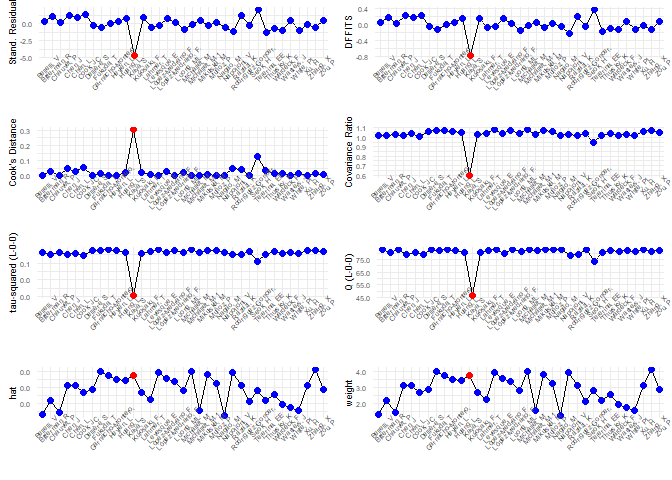
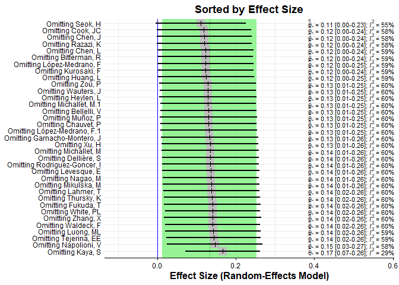
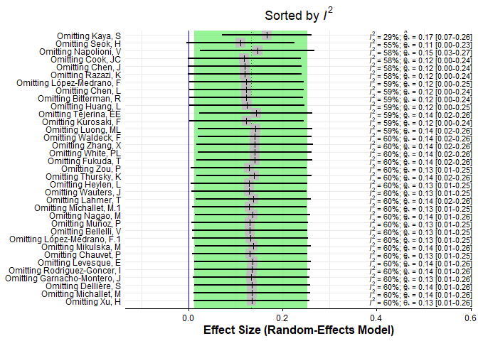
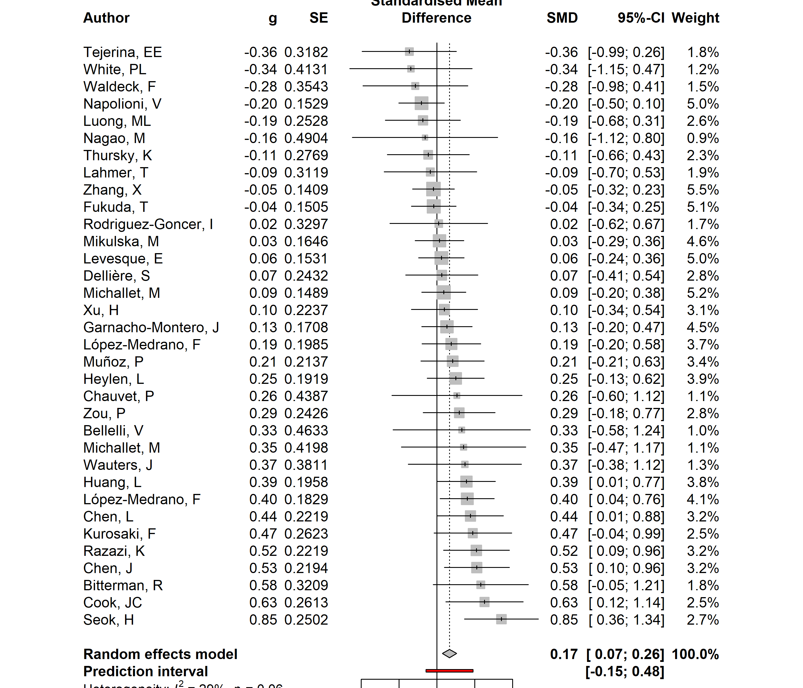
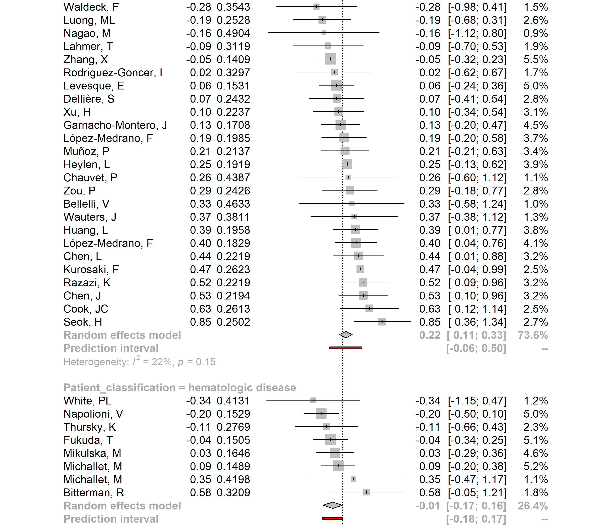

## Load R packages and data set


```r
library(dplyr)
library(meta)
library(metafor)
library(dmetar)
library(kableExtra)
library(ggplot2)
library(patchwork)
data_meta <- read.csv("data_YESadded2.csv", header = TRUE)
```

## Tidy up the data frame

We need to remove studies where it was not possible to extract complete information about patients. These studies would have `n_IA` labeled as `NA`. We will remove them using the function `filter`.

Arrange data into groups according to a primary disease of patients. This information is stored in `patient_g` column. During this step, the `mutate` function will be utilized. We will divide data into two categories:

1. Patients with blood disorders will be assigned to the `hematologic disease` group
2. All other patients will go to `other` group


```r
data_mean_r <- filter(data_meta, n_IA != "NA", .preserve = TRUE)

data_mean_rg <- data_mean_r %>%
               select(STUDY_ID:mean_report) %>%
               mutate(Patient_classification = case_when(
                 patient_g == "COVID19"  ~ "other",
                 patient_g == "vv_ECMO"  ~ "other",
                 patient_g == "pneumonia"  ~ "other",
                 patient_g == "liver_failure"  ~ "other",
                 patient_g == "kidney_transplantation"  ~ "other",
                 patient_g == "interstitial_pneumonia"  ~ "other",
                 patient_g == "influenza"  ~ "other",
                 patient_g == "hematology_oncology"  ~ "hematologic disease",
                 patient_g == "heart_transplanaion"  ~ "other",
                 patient_g == "febrile_neutropenic"  ~ "hematologic disease",
                 patient_g == "cystic_fibrosis"  ~ "other",
                 patient_g == "critically_ill"  ~ "other",
                 patient_g == "COPD"  ~ "other",
                 patient_g == "cirrhosis"  ~ "other",
                 patient_g == "cardiac_transplantation"  ~ "other",
                 patient_g == "ARDS"  ~ "other",
                 patient_g == "allogeneic_stem"  ~ "hematologic disease",
                 patient_g == "allogeneic_SCT"  ~ "hematologic disease",
                 patient_g == "allogeneic_HSCT"  ~ "hematologic disease",
                 patient_g == "allogeneic_HCT "  ~ "hematologic disease",
                 patient_g == "acute_myeloid_leukemia"  ~ "hematologic disease"
               )
               )
```

Let's have a quick overview of the data accumulated. We will explore a relative number of studies in a data set according to a patient's group, year of publication and study design. 


```r
p1 <- ggplot(data_mean_rg) + geom_bar(aes(x = Patient_classification)) 
p2 <- ggplot(data_mean_rg) + geom_bar(aes(x = YEAR)) 
data_mean_rg_noNA <- na.omit(subset(data_mean_rg, select = c(study_class)))
p3 <- ggplot(data_mean_rg_noNA) + geom_bar(aes(x = study_class)) 
```

By looking at the histogram we can see how many observations (counts) we have for each group.


```r
p1 | p2 | p3
```




Next, we will check the structure of the data frame. From seeing the structure, we can notice that some data is not stored correctly. For example, `n_noIA` is saved as a character when it should be numeric. To overcome this, transform all data that will be used for computation into a numeric class.


```r
str(data_mean_rg)
```

```
## 'data.frame':	35 obs. of  23 variables:
##  $ STUDY_ID              : int  10 11 15 27 30 55 61 65 88 96 ...
##  $ PMID                  : int  33339526 33316401 33205046 32993060 32907585 32494955 32279121 32176795 31417154 31177621 ...
##  $ AUTHORS               : chr  "Razazi, K" "Dellière, S" "Chauvet, P" "Bellelli, V" ...
##  $ YEAR                  : int  2020 2020 2020 2020 2020 2020 2020 2020 2019 2019 ...
##  $ n_IA                  : int  24 21 6 5 21 9 26 18 12 10 ...
##  $ n_noIA                : chr  "148" "87" "40" "72" ...
##  $ m_age_IA              : num  NA 61 66.5 NA NA ...
##  $ m_age_noIA            : num  NA 60 NA NA NA ...
##  $ SD_IA                 : num  NA 11 6.78 NA NA ...
##  $ SD_noIA               : num  NA 16 NA NA NA ...
##  $ md_IA                 : num  68 NA NA 59 67 NA 58 NA NA NA ...
##  $ md_noIA               : num  60 NA 66 53 60 NA 50 NA NA NA ...
##  $ R1_IA                 : num  59 NA NA 58 61 NA 54 NA NA NA ...
##  $ R2_IA                 : num  74 NA NA 71 82 NA 62 NA NA NA ...
##  $ R1_noIA               : num  52 NA 55.5 26.5 36 NA 38 NA NA NA ...
##  $ R2_noIA               : num  69 NA 70 75 76 NA 56 NA NA NA ...
##  $ patient_g             : chr  "ARDS" "COVID19" "COVID19" "influenza" ...
##  $ ICU                   : chr  "YES" "YES" "YES" "NO" ...
##  $ prophylaxis           : chr  "NO" "NO" "NO" "NO" ...
##  $ IA_class              : chr  "putative" "probable" "putative" NA ...
##  $ study_class           : chr  "cohort" "cohort" "cohort" "cohort" ...
##  $ mean_report           : chr  "NO" "YES" "NO" "NO" ...
##  $ Patient_classification: chr  "other" "other" "other" "other" ...
```

```r
data_mean_rg$n_IA <- as.numeric(data_mean_rg$n_IA)
data_mean_rg$n_noIA <- as.numeric(data_mean_rg$n_noIA)
#data_mean_rg$ICU <- ifelse(data_mean_rg$ICU=="YES",1,0)
#data_mean_rg$prophylaxis <- ifelse(data_mean_rg$prophylaxis=="YES",1,0)
```

##Prepare summary table
Let's prepare a table to present main information about collected data. This table will include following columns: first author, year of publication, underlying condition, group, total sample  size, type of study, incidence (if cohort).
First, we need to transform the column with information about patient's primary disease in a more readable format. For this we will create a new column `underlying_condition` and re-name each illness.


```r
data_mean_rT <- data_mean_rg %>%
               mutate(Underlying_condition = case_when(
                 patient_g == "COVID19"  ~ "COVID19",
                 patient_g == "vv_ECMO"  ~ "critically ill",
                 patient_g == "pneumonia"  ~ "pneumonia",
                 patient_g == "liver_failure"  ~ "liver failure",
                 patient_g == "kidney_transplantation"  ~ "kidney transplantation",
                 patient_g == "interstitial_pneumonia"  ~ "interstitial pneumonia",
                 patient_g == "influenza"  ~ "influenza",
                 patient_g == "hematology_oncology"  ~ "hematology",
                 patient_g == "heart_transplanaion"  ~ "heart transplanaion",
                 patient_g == "febrile_neutropenic"  ~ "febrile neutropenia",
                 patient_g == "cystic_fibrosis"  ~ "cystic fibrosis",
                 patient_g == "critically_ill"  ~ "critically ill",
                 patient_g == "COPD"  ~ "COPD",
                 patient_g == "cirrhosis"  ~ "cirrhosis",
                 patient_g == "cardiac_transplantation"  ~ "heart transplantation",
                 patient_g == "ARDS"  ~ "ARDS",
                 patient_g == "allogeneic_stem"  ~ "stem cell transplantation",
                 patient_g == "allogeneic_SCT"  ~ "stem cell transplantation",
                 patient_g == "allogeneic_HSCT"  ~ "stem cell transplantation",
                 patient_g == "allogeneic_HCT "  ~ "stem cell transplantation",
                 patient_g == "acute_myeloid_leukemia"  ~ "acute myeloid leukemia"
               )
               )
```

Now, we will create an additional column that sums the number of patients in each study.
Then, we will create a function that will calculate the occurrence of invasive aspergillosis in cohort studies.


```r
data_mean_rT1 <- mutate(data_mean_rT, Total_sample_size = n_noIA + n_IA) 
#create function
incidence_cal <- function (data, only)
{
  noIA <- data$n_noIA
  IA <- data$n_IA
  incidence <- IA/(noIA+IA)*100
  
  result <- ifelse(data$study_class == only, incidence, NA)
  
  return (result)
}

data_mean_rT2 <- data_mean_rT1
data_mean_rT2$Incidence <- incidence_cal(data_mean_rT2, "cohort")
```

Now, we will finally arrange a table and choose specific columns that should be there.


```r
data_mean_rT3 <- select(data_mean_rT2, AUTHORS, YEAR, Underlying_condition, Total_sample_size, study_class, Incidence)
```
We have to tidy up the table now. For this, we will fist round values representing incidence and also change the names of the columns. Here, we will start using `%>%`, which is a pipe operator that allows to chain functions together in a convenient fashion. This operator is a part of `dplyr` package. 


```r
data_mean_rT4 <- data_mean_rT3 %>%
                 mutate_if(is.numeric, round) %>%
                 rename(First_author = AUTHORS,
                        Year_of_publication = YEAR,
                        Incedence_percentage = Incidence, 
                        Study_class = study_class)
data_mean_rT4 %>%
  kbl() %>%
  kable_styling(bootstrap_options = c("striped", "hover", "condensed"), font_size = 11) %>%
  column_spec(6, color = "white",
              background = spec_color(data_mean_rT4$Total_sample_size, end = 0.7),
              popover = paste("am:", data_mean_rT4$Total_sample_size)) 
```

<table class="table table-striped table-hover table-condensed" style="font-size: 11px; margin-left: auto; margin-right: auto;">
 <thead>
  <tr>
   <th style="text-align:left;"> First_author </th>
   <th style="text-align:right;"> Year_of_publication </th>
   <th style="text-align:left;"> Underlying_condition </th>
   <th style="text-align:right;"> Total_sample_size </th>
   <th style="text-align:left;"> Study_class </th>
   <th style="text-align:right;"> Incedence_percentage </th>
  </tr>
 </thead>
<tbody>
  <tr>
   <td style="text-align:left;"> Razazi, K </td>
   <td style="text-align:right;"> 2020 </td>
   <td style="text-align:left;"> ARDS </td>
   <td style="text-align:right;"> 172 </td>
   <td style="text-align:left;"> cohort </td>
   <td style="text-align:right;color: white !important;background-color: rgba(71, 17, 100, 1) !important;" data-toggle="popover" data-container="body" data-trigger="hover" data-placement="right" data-content="am: 172"> 14 </td>
  </tr>
  <tr>
   <td style="text-align:left;"> Dellière, S </td>
   <td style="text-align:right;"> 2020 </td>
   <td style="text-align:left;"> COVID19 </td>
   <td style="text-align:right;"> 108 </td>
   <td style="text-align:left;"> cohort </td>
   <td style="text-align:right;color: white !important;background-color: rgba(70, 10, 93, 1) !important;" data-toggle="popover" data-container="body" data-trigger="hover" data-placement="right" data-content="am: 108"> 19 </td>
  </tr>
  <tr>
   <td style="text-align:left;"> Chauvet, P </td>
   <td style="text-align:right;"> 2020 </td>
   <td style="text-align:left;"> COVID19 </td>
   <td style="text-align:right;"> 46 </td>
   <td style="text-align:left;"> cohort </td>
   <td style="text-align:right;color: white !important;background-color: rgba(68, 3, 86, 1) !important;" data-toggle="popover" data-container="body" data-trigger="hover" data-placement="right" data-content="am: 46"> 13 </td>
  </tr>
  <tr>
   <td style="text-align:left;"> Bellelli, V </td>
   <td style="text-align:right;"> 2020 </td>
   <td style="text-align:left;"> influenza </td>
   <td style="text-align:right;"> 77 </td>
   <td style="text-align:left;"> cohort </td>
   <td style="text-align:right;color: white !important;background-color: rgba(69, 6, 90, 1) !important;" data-toggle="popover" data-container="body" data-trigger="hover" data-placement="right" data-content="am: 77"> 6 </td>
  </tr>
  <tr>
   <td style="text-align:left;"> Chen, L </td>
   <td style="text-align:right;"> 2020 </td>
   <td style="text-align:left;"> pneumonia </td>
   <td style="text-align:right;"> 693 </td>
   <td style="text-align:left;"> cohort </td>
   <td style="text-align:right;color: white !important;background-color: rgba(64, 69, 136, 1) !important;" data-toggle="popover" data-container="body" data-trigger="hover" data-placement="right" data-content="am: 693"> 3 </td>
  </tr>
  <tr>
   <td style="text-align:left;"> Waldeck, F </td>
   <td style="text-align:right;"> 2020 </td>
   <td style="text-align:left;"> influenza </td>
   <td style="text-align:right;"> 81 </td>
   <td style="text-align:left;"> cohort </td>
   <td style="text-align:right;color: white !important;background-color: rgba(70, 7, 90, 1) !important;" data-toggle="popover" data-container="body" data-trigger="hover" data-placement="right" data-content="am: 81"> 11 </td>
  </tr>
  <tr>
   <td style="text-align:left;"> Seok, H </td>
   <td style="text-align:right;"> 2020 </td>
   <td style="text-align:left;"> kidney transplantation </td>
   <td style="text-align:right;"> 78 </td>
   <td style="text-align:left;"> case_control </td>
   <td style="text-align:right;color: white !important;background-color: rgba(69, 6, 90, 1) !important;" data-toggle="popover" data-container="body" data-trigger="hover" data-placement="right" data-content="am: 78"> NA </td>
  </tr>
  <tr>
   <td style="text-align:left;"> Zou, P </td>
   <td style="text-align:right;"> 2020 </td>
   <td style="text-align:left;"> pneumonia </td>
   <td style="text-align:right;"> 335 </td>
   <td style="text-align:left;"> cohort </td>
   <td style="text-align:right;color: white !important;background-color: rgba(72, 35, 116, 1) !important;" data-toggle="popover" data-container="body" data-trigger="hover" data-placement="right" data-content="am: 335"> 5 </td>
  </tr>
  <tr>
   <td style="text-align:left;"> Lahmer, T </td>
   <td style="text-align:right;"> 2019 </td>
   <td style="text-align:left;"> cirrhosis </td>
   <td style="text-align:right;"> 84 </td>
   <td style="text-align:left;"> cohort </td>
   <td style="text-align:right;color: white !important;background-color: rgba(70, 7, 90, 1) !important;" data-toggle="popover" data-container="body" data-trigger="hover" data-placement="right" data-content="am: 84"> 14 </td>
  </tr>
  <tr>
   <td style="text-align:left;"> Tejerina, EE </td>
   <td style="text-align:right;"> 2019 </td>
   <td style="text-align:left;"> critically ill </td>
   <td style="text-align:right;"> 878 </td>
   <td style="text-align:left;"> cohort </td>
   <td style="text-align:right;color: white !important;background-color: rgba(58, 84, 140, 1) !important;" data-toggle="popover" data-container="body" data-trigger="hover" data-placement="right" data-content="am: 878"> 1 </td>
  </tr>
  <tr>
   <td style="text-align:left;"> Napolioni, V </td>
   <td style="text-align:right;"> 2019 </td>
   <td style="text-align:left;"> stem cell transplantation </td>
   <td style="text-align:right;"> 352 </td>
   <td style="text-align:left;"> cohort </td>
   <td style="text-align:right;color: white !important;background-color: rgba(72, 36, 117, 1) !important;" data-toggle="popover" data-container="body" data-trigger="hover" data-placement="right" data-content="am: 352"> 14 </td>
  </tr>
  <tr>
   <td style="text-align:left;"> Bitterman, R </td>
   <td style="text-align:right;"> 2019 </td>
   <td style="text-align:left;"> hematology </td>
   <td style="text-align:right;"> 107 </td>
   <td style="text-align:left;"> cohort </td>
   <td style="text-align:right;color: white !important;background-color: rgba(70, 10, 93, 1) !important;" data-toggle="popover" data-container="body" data-trigger="hover" data-placement="right" data-content="am: 107"> 10 </td>
  </tr>
  <tr>
   <td style="text-align:left;"> Levesque, E </td>
   <td style="text-align:right;"> 2019 </td>
   <td style="text-align:left;"> cirrhosis </td>
   <td style="text-align:right;"> 208 </td>
   <td style="text-align:left;"> case_control </td>
   <td style="text-align:right;color: white !important;background-color: rgba(72, 22, 104, 1) !important;" data-toggle="popover" data-container="body" data-trigger="hover" data-placement="right" data-content="am: 208"> NA </td>
  </tr>
  <tr>
   <td style="text-align:left;"> Huang, L </td>
   <td style="text-align:right;"> 2019 </td>
   <td style="text-align:left;"> influenza </td>
   <td style="text-align:right;"> 109 </td>
   <td style="text-align:left;"> case_control </td>
   <td style="text-align:right;color: white !important;background-color: rgba(70, 10, 93, 1) !important;" data-toggle="popover" data-container="body" data-trigger="hover" data-placement="right" data-content="am: 109"> NA </td>
  </tr>
  <tr>
   <td style="text-align:left;"> Cook, JC </td>
   <td style="text-align:right;"> 2018 </td>
   <td style="text-align:left;"> heart transplantation </td>
   <td style="text-align:right;"> 69 </td>
   <td style="text-align:left;"> case_control </td>
   <td style="text-align:right;color: white !important;background-color: rgba(69, 5, 89, 1) !important;" data-toggle="popover" data-container="body" data-trigger="hover" data-placement="right" data-content="am: 69"> NA </td>
  </tr>
  <tr>
   <td style="text-align:left;"> Rodriguez-Goncer, I </td>
   <td style="text-align:right;"> 2018 </td>
   <td style="text-align:left;"> critically ill </td>
   <td style="text-align:right;"> 125 </td>
   <td style="text-align:left;"> cohort </td>
   <td style="text-align:right;color: white !important;background-color: rgba(71, 12, 95, 1) !important;" data-toggle="popover" data-container="body" data-trigger="hover" data-placement="right" data-content="am: 125"> 8 </td>
  </tr>
  <tr>
   <td style="text-align:left;"> Kaya, S </td>
   <td style="text-align:right;"> 2017 </td>
   <td style="text-align:left;"> febrile neutropenia </td>
   <td style="text-align:right;"> 152 </td>
   <td style="text-align:left;"> case_control </td>
   <td style="text-align:right;color: white !important;background-color: rgba(71, 16, 99, 1) !important;" data-toggle="popover" data-container="body" data-trigger="hover" data-placement="right" data-content="am: 152"> NA </td>
  </tr>
  <tr>
   <td style="text-align:left;"> Zhang, X </td>
   <td style="text-align:right;"> 2017 </td>
   <td style="text-align:left;"> liver failure </td>
   <td style="text-align:right;"> 1077 </td>
   <td style="text-align:left;"> cohort </td>
   <td style="text-align:right;color: white !important;background-color: rgba(50, 101, 142, 1) !important;" data-toggle="popover" data-container="body" data-trigger="hover" data-placement="right" data-content="am: 1077"> 5 </td>
  </tr>
  <tr>
   <td style="text-align:left;"> White, PL </td>
   <td style="text-align:right;"> 2017 </td>
   <td style="text-align:left;"> hematology </td>
   <td style="text-align:right;"> 274 </td>
   <td style="text-align:left;"> cohort </td>
   <td style="text-align:right;color: white !important;background-color: rgba(72, 28, 110, 1) !important;" data-toggle="popover" data-container="body" data-trigger="hover" data-placement="right" data-content="am: 274"> 2 </td>
  </tr>
  <tr>
   <td style="text-align:left;"> López-Medrano, F </td>
   <td style="text-align:right;"> 2017 </td>
   <td style="text-align:left;"> kidney transplantation </td>
   <td style="text-align:right;"> 122 </td>
   <td style="text-align:left;"> case_control </td>
   <td style="text-align:right;color: white !important;background-color: rgba(70, 11, 94, 1) !important;" data-toggle="popover" data-container="body" data-trigger="hover" data-placement="right" data-content="am: 122"> NA </td>
  </tr>
  <tr>
   <td style="text-align:left;"> López-Medrano, F </td>
   <td style="text-align:right;"> 2016 </td>
   <td style="text-align:left;"> kidney transplantation </td>
   <td style="text-align:right;"> 102 </td>
   <td style="text-align:left;"> case_control </td>
   <td style="text-align:right;color: white !important;background-color: rgba(70, 9, 93, 1) !important;" data-toggle="popover" data-container="body" data-trigger="hover" data-placement="right" data-content="am: 102"> NA </td>
  </tr>
  <tr>
   <td style="text-align:left;"> Nagao, M </td>
   <td style="text-align:right;"> 2015 </td>
   <td style="text-align:left;"> liver failure </td>
   <td style="text-align:right;"> 30 </td>
   <td style="text-align:left;"> case_control </td>
   <td style="text-align:right;color: white !important;background-color: rgba(68, 1, 84, 1) !important;" data-toggle="popover" data-container="body" data-trigger="hover" data-placement="right" data-content="am: 30"> NA </td>
  </tr>
  <tr>
   <td style="text-align:left;"> Heylen, L </td>
   <td style="text-align:right;"> 2015 </td>
   <td style="text-align:left;"> kidney transplantation </td>
   <td style="text-align:right;"> 123 </td>
   <td style="text-align:left;"> case_control </td>
   <td style="text-align:right;color: white !important;background-color: rgba(70, 11, 94, 1) !important;" data-toggle="popover" data-container="body" data-trigger="hover" data-placement="right" data-content="am: 123"> NA </td>
  </tr>
  <tr>
   <td style="text-align:left;"> Kurosaki, F </td>
   <td style="text-align:right;"> 2014 </td>
   <td style="text-align:left;"> interstitial pneumonia </td>
   <td style="text-align:right;"> 539 </td>
   <td style="text-align:left;"> cohort </td>
   <td style="text-align:right;color: white !important;background-color: rgba(69, 55, 129, 1) !important;" data-toggle="popover" data-container="body" data-trigger="hover" data-placement="right" data-content="am: 539"> 3 </td>
  </tr>
  <tr>
   <td style="text-align:left;"> Luong, ML </td>
   <td style="text-align:right;"> 2013 </td>
   <td style="text-align:left;"> cystic fibrosis </td>
   <td style="text-align:right;"> 93 </td>
   <td style="text-align:left;"> cohort </td>
   <td style="text-align:right;color: white !important;background-color: rgba(70, 8, 92, 1) !important;" data-toggle="popover" data-container="body" data-trigger="hover" data-placement="right" data-content="am: 93"> 22 </td>
  </tr>
  <tr>
   <td style="text-align:left;"> Chen, J </td>
   <td style="text-align:right;"> 2013 </td>
   <td style="text-align:left;"> liver failure </td>
   <td style="text-align:right;"> 87 </td>
   <td style="text-align:left;"> case_control </td>
   <td style="text-align:right;color: white !important;background-color: rgba(70, 7, 90, 1) !important;" data-toggle="popover" data-container="body" data-trigger="hover" data-placement="right" data-content="am: 87"> NA </td>
  </tr>
  <tr>
   <td style="text-align:left;"> Wauters, J </td>
   <td style="text-align:right;"> 2012 </td>
   <td style="text-align:left;"> influenza </td>
   <td style="text-align:right;"> 40 </td>
   <td style="text-align:left;"> cohort </td>
   <td style="text-align:right;color: white !important;background-color: rgba(68, 1, 86, 1) !important;" data-toggle="popover" data-container="body" data-trigger="hover" data-placement="right" data-content="am: 40"> 22 </td>
  </tr>
  <tr>
   <td style="text-align:left;"> Xu, H </td>
   <td style="text-align:right;"> 2011 </td>
   <td style="text-align:left;"> COPD </td>
   <td style="text-align:right;"> 90 </td>
   <td style="text-align:left;"> case_control </td>
   <td style="text-align:right;color: white !important;background-color: rgba(70, 8, 92, 1) !important;" data-toggle="popover" data-container="body" data-trigger="hover" data-placement="right" data-content="am: 90"> NA </td>
  </tr>
  <tr>
   <td style="text-align:left;"> Michallet, M </td>
   <td style="text-align:right;"> 2011 </td>
   <td style="text-align:left;"> acute myeloid leukemia </td>
   <td style="text-align:right;"> 261 </td>
   <td style="text-align:left;"> cohort </td>
   <td style="text-align:right;color: white !important;background-color: rgba(72, 27, 109, 1) !important;" data-toggle="popover" data-container="body" data-trigger="hover" data-placement="right" data-content="am: 261"> 22 </td>
  </tr>
  <tr>
   <td style="text-align:left;"> Michallet, M </td>
   <td style="text-align:right;"> 2011 </td>
   <td style="text-align:left;"> acute myeloid leukemia </td>
   <td style="text-align:right;"> 117 </td>
   <td style="text-align:left;"> case_control </td>
   <td style="text-align:right;color: white !important;background-color: rgba(70, 11, 94, 1) !important;" data-toggle="popover" data-container="body" data-trigger="hover" data-placement="right" data-content="am: 117"> NA </td>
  </tr>
  <tr>
   <td style="text-align:left;"> Mikulska, M </td>
   <td style="text-align:right;"> 2009 </td>
   <td style="text-align:left;"> stem cell transplantation </td>
   <td style="text-align:right;"> 304 </td>
   <td style="text-align:left;"> cohort </td>
   <td style="text-align:right;color: white !important;background-color: rgba(72, 32, 113, 1) !important;" data-toggle="popover" data-container="body" data-trigger="hover" data-placement="right" data-content="am: 304"> 14 </td>
  </tr>
  <tr>
   <td style="text-align:left;"> Garnacho-Montero, J </td>
   <td style="text-align:right;"> 2005 </td>
   <td style="text-align:left;"> critically ill </td>
   <td style="text-align:right;"> 756 </td>
   <td style="text-align:left;"> NA </td>
   <td style="text-align:right;color: white !important;background-color: rgba(62, 74, 137, 1) !important;" data-toggle="popover" data-container="body" data-trigger="hover" data-placement="right" data-content="am: 756"> NA </td>
  </tr>
  <tr>
   <td style="text-align:left;"> Fukuda, T </td>
   <td style="text-align:right;"> 2004 </td>
   <td style="text-align:left;"> stem cell transplantation </td>
   <td style="text-align:right;"> 2319 </td>
   <td style="text-align:left;"> cohort </td>
   <td style="text-align:right;color: white !important;background-color: rgba(67, 191, 113, 1) !important;" data-toggle="popover" data-container="body" data-trigger="hover" data-placement="right" data-content="am: 2319"> 2 </td>
  </tr>
  <tr>
   <td style="text-align:left;"> Thursky, K </td>
   <td style="text-align:right;"> 2004 </td>
   <td style="text-align:left;"> stem cell transplantation </td>
   <td style="text-align:right;"> 206 </td>
   <td style="text-align:left;"> cohort </td>
   <td style="text-align:right;color: white !important;background-color: rgba(72, 22, 104, 1) !important;" data-toggle="popover" data-container="body" data-trigger="hover" data-placement="right" data-content="am: 206"> 7 </td>
  </tr>
  <tr>
   <td style="text-align:left;"> Muñoz, P </td>
   <td style="text-align:right;"> 2004 </td>
   <td style="text-align:left;"> heart transplanaion </td>
   <td style="text-align:right;"> 278 </td>
   <td style="text-align:left;"> cohort </td>
   <td style="text-align:right;color: white !important;background-color: rgba(72, 28, 111, 1) !important;" data-toggle="popover" data-container="body" data-trigger="hover" data-placement="right" data-content="am: 278"> 9 </td>
  </tr>
</tbody>
</table>


## Calculate effect sizes as the standardized mean differences
Next, the `meta` package will be used to calculate the standardized mean difference. Here, we will go to our original data frame `data_mean_rT2`.
For computational manipulations, some information is better stored in `1` that represents `yes` and `0` that represents `no`. 


```r
data_mean_rT2$ICU <- ifelse(data_mean_rT2$ICU=="YES",1,0)
data_mean_rT2$prophylaxis <- ifelse(data_mean_rT2$prophylaxis=="YES",1,0)
data_mean_rT2$study_class <- ifelse(data_mean_rT2$study_class=="cohort",1,0)
```

Let's make a first analysis and have a look at the first results.

```r
#data_meta_del.ou <- data_meta[-c(9,16,18,26,36), ]
meta_med <- metacont(n.e = n_IA,
                   mean.e = m_age_IA,
                   sd.e = SD_IA,
                   n.c = n_noIA,
                   mean.c = m_age_noIA,
                   sd.c = SD_noIA,
                   studlab = AUTHORS,
                   data = data_mean_rT2,
                   median.e = md_IA,
                   q1.e = R1_IA,
                   q3.e = R2_IA,
                   median.c = md_noIA,
                   q1.c = R1_noIA,
                   q3.c = R2_noIA,
                   method.mean = "Luo",
                   method.sd = "Shi",
                   sm = "SMD",
                   method.smd = "Hedges",
                   comb.fixed = FALSE,
                   comb.random = TRUE,
                   method.tau = "REML",
                   hakn = TRUE,
                   title = "Age as a risk factor for IA",
                   prediction = TRUE)
png(file = "forestplot_med.png", width = 2800, height = 2400, res = 300)
forest.meta(meta_med, 
            sortvar = TE,
            predict = TRUE, 
            print.tau2 = FALSE,
            leftcols = c("studlab", "TE", "seTE"),
            leftlabs = c("Author", "g", "SE"),
            label.left = "Younger",
            label.right = "Older")
dev.off()
```

```
## png 
##   2
```

```r
meta_med
```

```
## Review:     Age as a risk factor for IA
## 
##                         SMD             95%-CI %W(random)
## Razazi, K            0.5219 [ 0.0870;  0.9568]        3.1
## Dellière, S          0.0654 [-0.4112;  0.5420]        2.9
## Chauvet, P           0.2636 [-0.5963;  1.1236]        1.4
## Bellelli, V          0.3283 [-0.5797;  1.2363]        1.3
## Chen, L              0.4428 [ 0.0079;  0.8778]        3.1
## Waldeck, F          -0.2848 [-0.9792;  0.4096]        1.9
## Seok, H              0.8523 [ 0.3619;  1.3427]        2.8
## Zou, P               0.2943 [-0.1811;  0.7698]        2.9
## Lahmer, T           -0.0858 [-0.6971;  0.5254]        2.2
## Tejerina, EE        -0.3646 [-0.9882;  0.2590]        2.2
## Napolioni, V        -0.2030 [-0.5026;  0.0967]        4.0
## Bitterman, R         0.5796 [-0.0493;  1.2084]        2.2
## Levesque, E          0.0590 [-0.2410;  0.3590]        4.0
## Huang, L             0.3893 [ 0.0056;  0.7731]        3.4
## Cook, JC             0.6288 [ 0.1168;  1.1409]        2.7
## Rodriguez-Goncer, I  0.0240 [-0.6222;  0.6702]        2.1
## Kaya, S             -0.9118 [-1.2495; -0.5741]        3.7
## Zhang, X            -0.0453 [-0.3214;  0.2308]        4.1
## White, PL           -0.3437 [-1.1533;  0.4659]        1.6
## López-Medrano, F     0.4011 [ 0.0426;  0.7597]        3.6
## López-Medrano, F     0.1911 [-0.1979;  0.5802]        3.4
## Nagao, M            -0.1570 [-1.1181;  0.8042]        1.2
## Heylen, L            0.2484 [-0.1278;  0.6247]        3.5
## Kurosaki, F          0.4745 [-0.0395;  0.9886]        2.7
## Luong, ML           -0.1854 [-0.6808;  0.3101]        2.8
## Chen, J              0.5268 [ 0.0968;  0.9569]        3.2
## Wauters, J           0.3696 [-0.3774;  1.1166]        1.7
## Xu, H                0.0997 [-0.3388;  0.5382]        3.1
## Michallet, M         0.0896 [-0.2023;  0.3815]        4.0
## Michallet, M         0.3516 [-0.4711;  1.1744]        1.5
## Mikulska, M          0.0333 [-0.2893;  0.3559]        3.8
## Garnacho-Montero, J  0.1323 [-0.2025;  0.4671]        3.8
## Fukuda, T           -0.0409 [-0.3359;  0.2542]        4.0
## Thursky, K          -0.1139 [-0.6566;  0.4288]        2.6
## Muñoz, P             0.2075 [-0.2114;  0.6264]        3.2
## 
## Number of studies combined: k = 35
## 
##                         SMD            95%-CI    t p-value
## Random effects model 0.1328 [ 0.0131; 0.2525] 2.26  0.0307
## Prediction interval         [-0.4242; 0.6898]             
## 
## Quantifying heterogeneity:
##  tau^2 = 0.0715 [0.0242; 0.1428]; tau = 0.2674 [0.1555; 0.3779]
##  I^2 = 58.9% [40.3%; 71.7%]; H = 1.56 [1.29; 1.88]
## 
## Test of heterogeneity:
##      Q d.f.  p-value
##  82.70   34 < 0.0001
## 
## Details on meta-analytical method:
## - Inverse variance method
## - Restricted maximum-likelihood estimator for tau^2
## - Q-profile method for confidence interval of tau^2 and tau
## - Hartung-Knapp adjustment for random effects model
## - Hedges' g (bias corrected standardised mean difference)
```


```r
knitr::include_graphics(rep("forestplot_med.png", 1))
```



Based on the first result we can see that the heterogeneity is not trivial and that we need to check if there are potential data points that strongly influence the outcome. 

## Check for potential outliers
Let's check if our data contains any outliers or influential cases that may affect robustness of the result.

```r
m.count.no <- find.outliers(meta_med)  
m.count.no
```

```
## Identified outliers (random-effects model) 
## ------------------------------------------ 
## "Seok, H", "Kaya, S" 
##  
## Results with outliers removed 
## ----------------------------- 
## Review:     Age as a risk factor for IA
## 
##                         SMD             95%-CI %W(random) exclude
## Razazi, K            0.5219 [ 0.0870;  0.9568]        3.2        
## Dellière, S          0.0654 [-0.4112;  0.5420]        2.8        
## Chauvet, P           0.2636 [-0.5963;  1.1236]        1.0        
## Bellelli, V          0.3283 [-0.5797;  1.2363]        0.9        
## Chen, L              0.4428 [ 0.0079;  0.8778]        3.2        
## Waldeck, F          -0.2848 [-0.9792;  0.4096]        1.4        
## Seok, H              0.8523 [ 0.3619;  1.3427]        0.0       *
## Zou, P               0.2943 [-0.1811;  0.7698]        2.8        
## Lahmer, T           -0.0858 [-0.6971;  0.5254]        1.8        
## Tejerina, EE        -0.3646 [-0.9882;  0.2590]        1.7        
## Napolioni, V        -0.2030 [-0.5026;  0.0967]        5.5        
## Bitterman, R         0.5796 [-0.0493;  1.2084]        1.7        
## Levesque, E          0.0590 [-0.2410;  0.3590]        5.5        
## Huang, L             0.3893 [ 0.0056;  0.7731]        3.9        
## Cook, JC             0.6288 [ 0.1168;  1.1409]        2.4        
## Rodriguez-Goncer, I  0.0240 [-0.6222;  0.6702]        1.6        
## Kaya, S             -0.9118 [-1.2495; -0.5741]        0.0       *
## Zhang, X            -0.0453 [-0.3214;  0.2308]        6.2        
## White, PL           -0.3437 [-1.1533;  0.4659]        1.1        
## López-Medrano, F     0.4011 [ 0.0426;  0.7597]        4.3        
## López-Medrano, F     0.1911 [-0.1979;  0.5802]        3.8        
## Nagao, M            -0.1570 [-1.1181;  0.8042]        0.8        
## Heylen, L            0.2484 [-0.1278;  0.6247]        4.0        
## Kurosaki, F          0.4745 [-0.0395;  0.9886]        2.4        
## Luong, ML           -0.1854 [-0.6808;  0.3101]        2.6        
## Chen, J              0.5268 [ 0.0968;  0.9569]        3.3        
## Wauters, J           0.3696 [-0.3774;  1.1166]        1.2        
## Xu, H                0.0997 [-0.3388;  0.5382]        3.2        
## Michallet, M         0.0896 [-0.2023;  0.3815]        5.7        
## Michallet, M         0.3516 [-0.4711;  1.1744]        1.0        
## Mikulska, M          0.0333 [-0.2893;  0.3559]        5.0        
## Garnacho-Montero, J  0.1323 [-0.2025;  0.4671]        4.8        
## Fukuda, T           -0.0409 [-0.3359;  0.2542]        5.7        
## Thursky, K          -0.1139 [-0.6566;  0.4288]        2.2        
## Muñoz, P             0.2075 [-0.2114;  0.6264]        3.4        
## 
## Number of studies combined: k = 33
## 
##                         SMD            95%-CI    t p-value
## Random effects model 0.1445 [ 0.0564; 0.2326] 3.34  0.0021
## Prediction interval         [-0.0956; 0.3846]             
## 
## Quantifying heterogeneity:
##  tau^2 = 0.0120 [0.0000; 0.0577]; tau = 0.1095 [0.0000; 0.2402]
##  I^2 = 16.5% [0.0%; 45.8%]; H = 1.09 [1.00; 1.36]
## 
## Test of heterogeneity:
##      Q d.f. p-value
##  38.32   32  0.2045
## 
## Details on meta-analytical method:
## - Inverse variance method
## - Restricted maximum-likelihood estimator for tau^2
## - Q-profile method for confidence interval of tau^2 and tau
## - Hartung-Knapp adjustment for random effects model
## - Hedges' g (bias corrected standardised mean difference)
```

```r
m.cont.inf <- InfluenceAnalysis(meta_med, random = TRUE)
```

```
## [===========================================================================] DONE
```

```r
plot(m.cont.inf, "influence")
```

<!-- -->

It seems that the data contains outliers that may have a substantial effect on heterogeneity. 

Let's further check if the removal of any data point from our data frame significantly impacts the overall heterogeneity. 


```r
plot(m.cont.inf, "es")
```

<!-- -->

```r
plot(m.cont.inf, "i2")
```

<!-- -->


Omitting the outlier named `Kaya, S` significantly changed the effect size and I^2, suggesting that it is true outlier. At the same time, another potential outlier `Seok, H` did not significantly changed those parameters. It was decided to leave that data point in a further analysis. 
 


```r
meta_med_del_ou1 <-data_mean_rT2[data_mean_rT2$AUTHORS !="Kaya, S", ]

data_meta2 <- metacont(n.e = n_IA,
                   mean.e = m_age_IA,
                   sd.e = SD_IA,
                   n.c = n_noIA,
                   mean.c = m_age_noIA,
                   sd.c = SD_noIA,
                   studlab = AUTHORS,
                   data = meta_med_del_ou1,
                   median.e = md_IA,
                   q1.e = R1_IA,
                   q3.e = R2_IA,
                   median.c = md_noIA,
                   q1.c = R1_noIA,
                   q3.c = R2_noIA,
                   method.mean = "Luo",
                   method.sd = "Shi",
                   sm = "SMD",
                   method.smd = "Hedges",
                   comb.fixed = FALSE,
                   comb.random = TRUE,
                   method.tau = "REML",
                   hakn = TRUE,
                   title = "Age as a risk factor for IA",
                   prediction = TRUE)
png(file = "forestplot_med_del_ou.png", width = 2800, height = 2400, res = 300)
forest.meta(data_meta2, 
            sortvar = TE,
            predict = TRUE, 
            print.tau2 = FALSE,
            leftcols = c("studlab", "TE", "seTE"),
            leftlabs = c("Author", "g", "SE"),
            label.left = "Younger",
            label.right = "Older")
dev.off()
```

```
## png 
##   2
```

```r
data_meta2
```

```
## Review:     Age as a risk factor for IA
## 
##                         SMD            95%-CI %W(random)
## Razazi, K            0.5219 [ 0.0870; 0.9568]        3.2
## Dellière, S          0.0654 [-0.4112; 0.5420]        2.8
## Chauvet, P           0.2636 [-0.5963; 1.1236]        1.1
## Bellelli, V          0.3283 [-0.5797; 1.2363]        1.0
## Chen, L              0.4428 [ 0.0079; 0.8778]        3.2
## Waldeck, F          -0.2848 [-0.9792; 0.4096]        1.5
## Seok, H              0.8523 [ 0.3619; 1.3427]        2.7
## Zou, P               0.2943 [-0.1811; 0.7698]        2.8
## Lahmer, T           -0.0858 [-0.6971; 0.5254]        1.9
## Tejerina, EE        -0.3646 [-0.9882; 0.2590]        1.8
## Napolioni, V        -0.2030 [-0.5026; 0.0967]        5.0
## Bitterman, R         0.5796 [-0.0493; 1.2084]        1.8
## Levesque, E          0.0590 [-0.2410; 0.3590]        5.0
## Huang, L             0.3893 [ 0.0056; 0.7731]        3.8
## Cook, JC             0.6288 [ 0.1168; 1.1409]        2.5
## Rodriguez-Goncer, I  0.0240 [-0.6222; 0.6702]        1.7
## Zhang, X            -0.0453 [-0.3214; 0.2308]        5.5
## White, PL           -0.3437 [-1.1533; 0.4659]        1.2
## López-Medrano, F     0.4011 [ 0.0426; 0.7597]        4.1
## López-Medrano, F     0.1911 [-0.1979; 0.5802]        3.7
## Nagao, M            -0.1570 [-1.1181; 0.8042]        0.9
## Heylen, L            0.2484 [-0.1278; 0.6247]        3.9
## Kurosaki, F          0.4745 [-0.0395; 0.9886]        2.5
## Luong, ML           -0.1854 [-0.6808; 0.3101]        2.6
## Chen, J              0.5268 [ 0.0968; 0.9569]        3.2
## Wauters, J           0.3696 [-0.3774; 1.1166]        1.3
## Xu, H                0.0997 [-0.3388; 0.5382]        3.1
## Michallet, M         0.0896 [-0.2023; 0.3815]        5.2
## Michallet, M         0.3516 [-0.4711; 1.1744]        1.1
## Mikulska, M          0.0333 [-0.2893; 0.3559]        4.6
## Garnacho-Montero, J  0.1323 [-0.2025; 0.4671]        4.5
## Fukuda, T           -0.0409 [-0.3359; 0.2542]        5.1
## Thursky, K          -0.1139 [-0.6566; 0.4288]        2.3
## Muñoz, P             0.2075 [-0.2114; 0.6264]        3.4
## 
## Number of studies combined: k = 34
## 
##                         SMD            95%-CI    t p-value
## Random effects model 0.1667 [ 0.0711; 0.2624] 3.55  0.0012
## Prediction interval         [-0.1453; 0.4788]             
## 
## Quantifying heterogeneity:
##  tau^2 = 0.0213 [0.0000; 0.0781]; tau = 0.1458 [0.0000; 0.2795]
##  I^2 = 28.8% [0.0%; 53.5%]; H = 1.19 [1.00; 1.47]
## 
## Test of heterogeneity:
##      Q d.f. p-value
##  46.34   33  0.0616
## 
## Details on meta-analytical method:
## - Inverse variance method
## - Restricted maximum-likelihood estimator for tau^2
## - Q-profile method for confidence interval of tau^2 and tau
## - Hartung-Knapp adjustment for random effects model
## - Hedges' g (bias corrected standardised mean difference)
```


```r
knitr::include_graphics(rep("forestplot_med_del_ou.png", 1))
```



Now I want to perform a group analysis and check if patients with hematologic disease had a significantly different age difference than patients with other underlying conditions. 


```r
data_mean_rg_gr <- metacont(n.e = n_IA,
                            mean.e = m_age_IA,
                            sd.e = SD_IA,
                            n.c = n_noIA,
                            mean.c = m_age_noIA,
                            sd.c = SD_noIA,
                            studlab = AUTHORS,
                            data = meta_med_del_ou1,
                            median.e = md_IA,
                            q1.e = R1_IA,
                            q3.e = R2_IA,
                            median.c = md_noIA,
                            q1.c = R1_noIA,
                            q3.c = R2_noIA,
                            method.mean = "Luo",
                            method.sd = "Shi",
                            sm = "SMD",
                            method.smd = "Hedges",
                            comb.fixed = FALSE,
                            comb.random = TRUE,
                            method.tau = "REML",
                            hakn = TRUE,
                            title = "Age as a risk factor for IA",
                            prediction = TRUE, 
                            byvar = Patient_classification)
png(file = "forestplot_med_del_GR.png", width = 2800, height = 2400, res = 300)
forest.meta(data_mean_rg_gr, 
            sortvar = TE,
            predict = TRUE, 
            print.tau2 = FALSE,
            leftcols = c("studlab", "TE", "seTE"),
            leftlabs = c("Author", "g", "SE"),
            label.left = "Younger",
            label.right = "Older")
dev.off()
```

```
## png 
##   2
```

```r
knitr::include_graphics(rep("forestplot_med_del_GR.png", 1))
```



